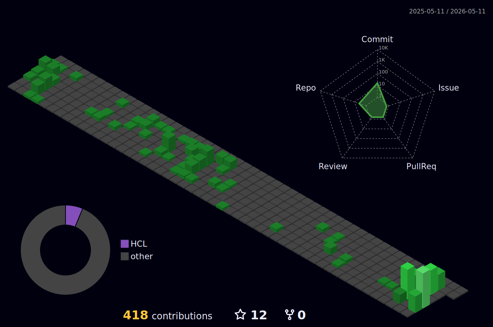

<h1 align="center">
  <a href="https://github.com/victorrocha2910">
    
  </a>
</h1>

<p align="center">
  <a href="https://www.linkedin.com/in/victor-rodrigues-da-rocha-a320301a7" target="_blank">
    
  </a>
  <a href="mailto:victorrocha2910@gmail.com">
    
  </a>
  <a href="https://github.com/victorrocha2910">
    
  </a>
  
</p>

---

## 🧑‍💻 Sobre mim

```yaml
name: Victor Rodrigues da Rocha
role: Fullstack Developer & DevSecOps Pleno
focus:
  - Construindo aplicações escaláveis e seguras de ponta a ponta
  - Automação de pipelines CI/CD com segurança "shift-left"
  - Infraestrutura como código, observabilidade e cloud-native
currently_learning:
  - Azure DevOps avançado, Kubernetes, SRE
  - Machine Learning aplicado a segurança
hobbies:
  - 🏃 Trail running
  - 🥾 Trekking
fun_fact: "Fora do teclado, geralmente em alguma trilha."
```

- 🔭 Atuando com **DevSecOps**, **Cloud** e **Desenvolvimento Fullstack**
- 🌱 Estudando **Azure DevOps**, **Kubernetes**, **SRE** e **Machine Learning**
- 🛡️ Apaixonado por **segurança da informação**, **automação** e **boas práticas de engenharia**
- 📫 Contato: **victorrocha2910@gmail.com**

---

## 🛠️ Stack & Ferramentas

### 💻 Linguagens
<p>
  
  
  
  
  
  
</p>

### 🎨 Frontend
<p>
  
  
  
  
  
</p>

### ⚙️ Backend & Banco de Dados
<p>
  
  
  
  
  
  
</p>

### ☁️ Cloud & DevOps
<p>
  
  
  
  
  
  
  
  
  
</p>

### 🛡️ DevSecOps & Segurança
<p>
  
  
  
  
  
  
</p>

### 📊 Observabilidade & Monitoramento
<p>
  
  
  
  
</p>

---

## 📈 GitHub Stats

<p align="center">
  
  
</p>

<p align="center">
  
</p>

<p align="center">
  
</p>

---

## 🌐 Atividade & Contribuições



<p align="center">
  
</p>

---

## 🏔️ Fora do código

Quando não tô no terminal, geralmente tô em alguma trilha 🏃🥾

<p>
  
  
</p>

---

## 🤝 Vamos nos conectar?

<p align="center">
  Sempre aberto a trocar ideias sobre <strong>DevSecOps</strong>, <strong>Cloud</strong>, <strong>arquitetura de software</strong> e <strong>segurança</strong>.
  <br/>
  Se quiser bater um papo, só chamar!
</p>

<p align="center">
  <a href="https://www.linkedin.com/in/victor-rodrigues-da-rocha-a320301a7" target="_blank">
    
  </a>
  <a href="mailto:victorrocha2910@gmail.com">
    
  </a>
</p>

<p align="center">
  
</p>
